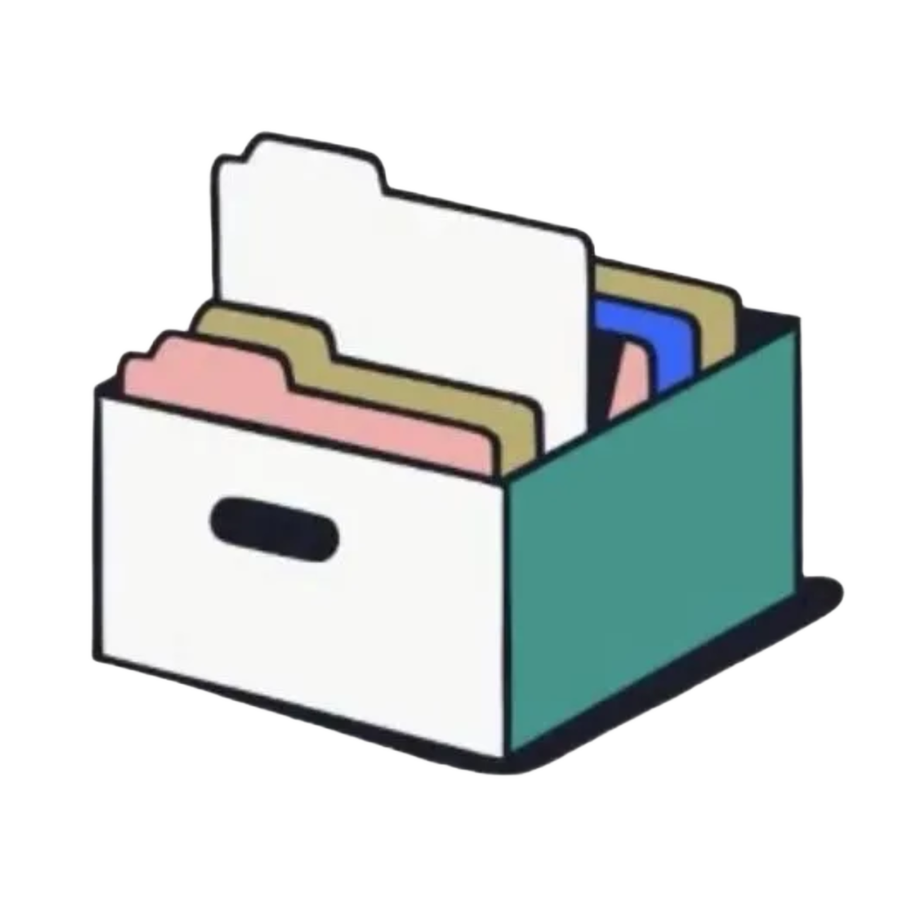
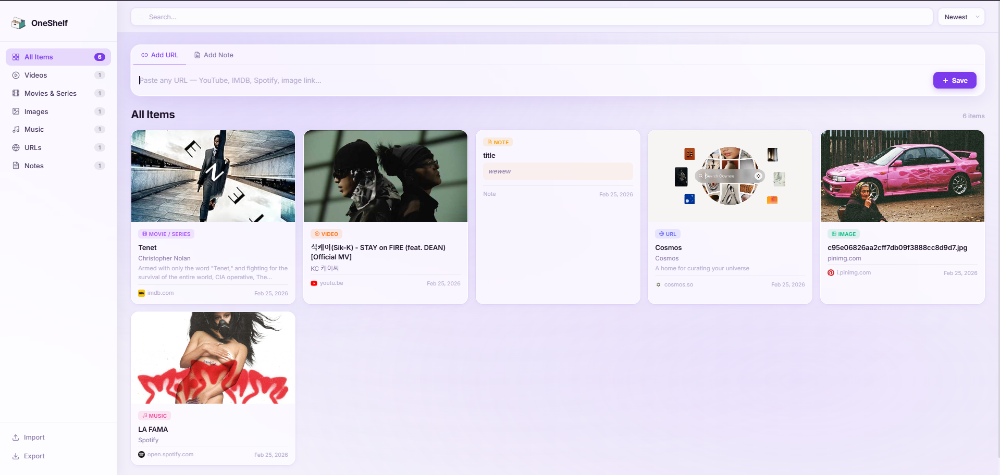

# OneShelf

  

A clean, personal web shelf to save anything you find online. Paste a link and it automatically pulls the title, description, thumbnail and metadata — no account, no login.

**Inspired by:** Mymind

---

## Features

- Paste any URL and it fetches metadata automatically
- Supports YouTube, IMDB, Spotify, Apple Music, images, and general websites
- Write and save plain text notes
- Filter by type — Videos, Movies, Music, Images, URLs, Notes
- Search across all saved items
- Sort by newest, oldest, A→Z, or type
- Export your shelf as a JSON file
- Import a previously exported file (duplicates are skipped)
- Works on desktop and mobile

---

## Screenshot

## How URL Detection Works

| URL | Saved as |
|---|---|
| youtube.com, youtu.be | Video |
| imdb.com | Movie / Series |
| spotify.com, music.apple.com, soundcloud.com | Music |
| Direct image links (.jpg, .png, .gif…) | Image |
| Everything else | URL |

Notes are added manually via the **Add Note** tab.

---

## Data & Privacy

All data is stored in your browser's `localStorage`. Nothing is sent to any server. Exporting saves a `.json` file to your device which you can re-import on any device.

---

## Future Improvements

**Accounts & Cloud Sync**
- User accounts with sign in so your shelf follows you across devices
- Cloud database backend so nothing is lost if you clear your browser
- Real-time sync — add something on your phone, see it instantly on desktop

**Platform API Integrations**
- **Spotify** — pull real track/album/playlist data, show play count, preview audio
- **Netflix** — sync your watchlist and viewing history directly
- **Apple Music** — fetch artwork, tracklist, and album details
- **YouTube** — show view count, channel info, and video duration
- **IMDB** — deeper data like full cast, ratings, and trailers

**Live Activity Tracking**
- **Netflix** — automatically adds movies and shows as you watch them, no link pasting needed
- **Spotify** — tracks songs, albums and podcasts you listen to and adds them in real time
- **Apple Music** — syncs your listening history as it happens
- **YouTube** — logs videos you watch and adds them to your shelf automatically

**Better Organisation**
- Custom collections and folders within the shelf
- Tags you can create and assign manually
- Bulk actions — select multiple items to delete, move, or export
- Browser extension to save links in one click without opening the app

**Smarter Metadata**
- Automatic re-fetch to keep thumbnails and titles up to date
- AI-powered content summaries and recommendations based on what you save