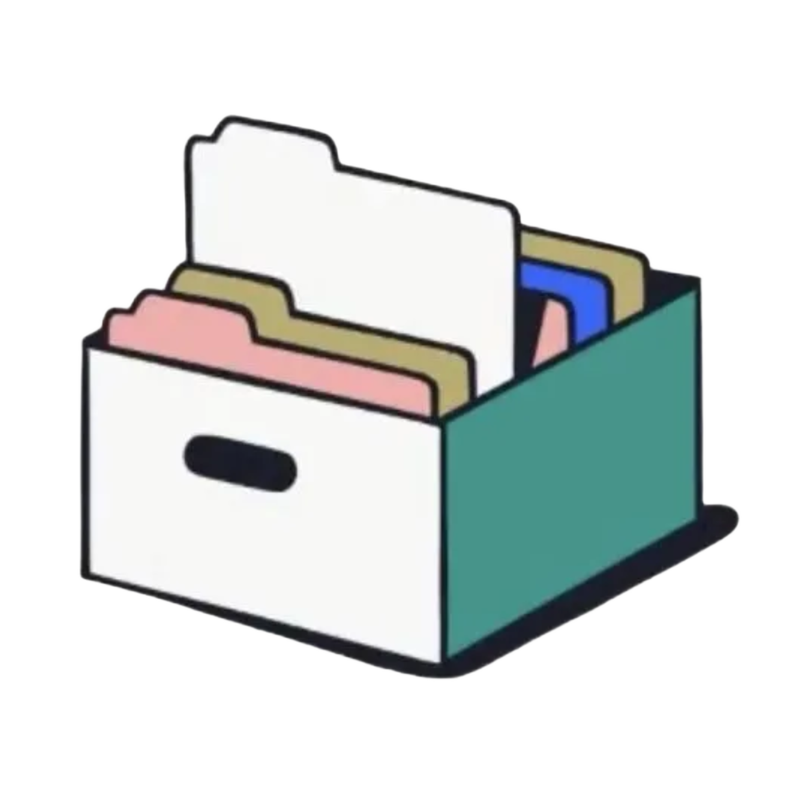
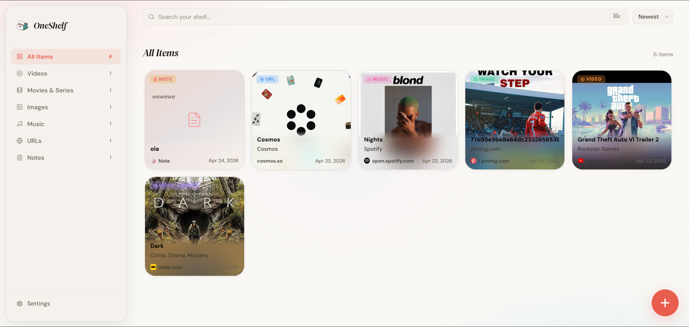

# OneShelf

  

OneShelf is a clean, privacy-focused digital library for your links and notes. Paste any URL, and it automatically organizes it with rich thumbnails and metadata.

**No accounts. No trackers. Just your data.**

---

---

### Features

- **Smart Extraction**: Fetches thumbnails and metadata for YouTube, IMDb, and more.
- **Integrated Notes**: Save snippets, thoughts, or reminders alongside your bookmarks.
- **Easy Organization**: Filter by content type.
- **Data Portability**: Export or import your entire library as JSON at any time.

### Privacy

- **Local Only**: Your data is stored entirely within your browser's local storage.
- **No Tracking**: Zero analytics, trackers, or server-side interactions.

---

### Details

- Uses a custom regex-based detection engine to categorize content types.
- For the development roadmap, see [improvements.md](improvements.md).